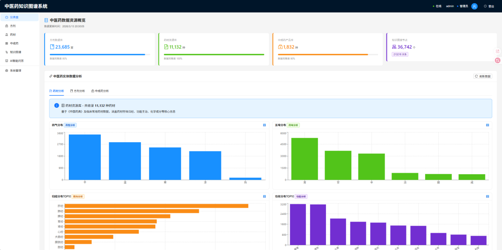
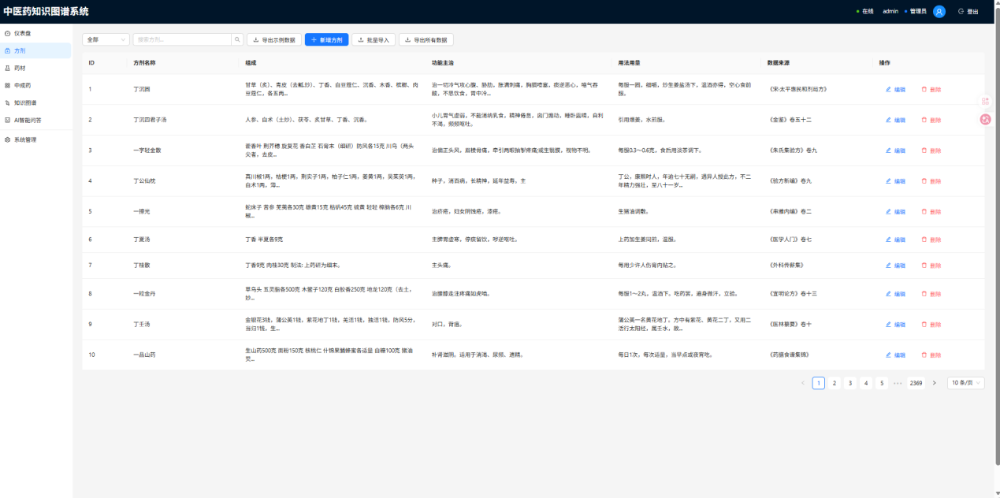
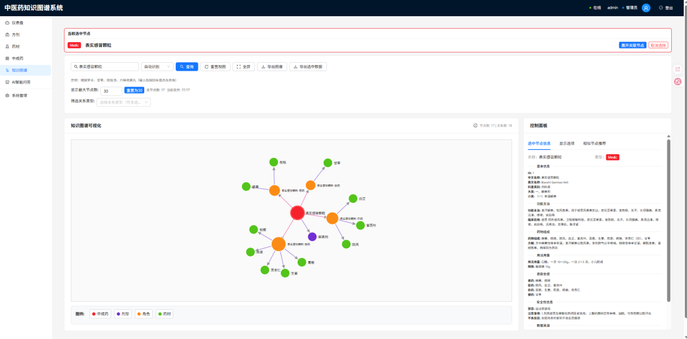
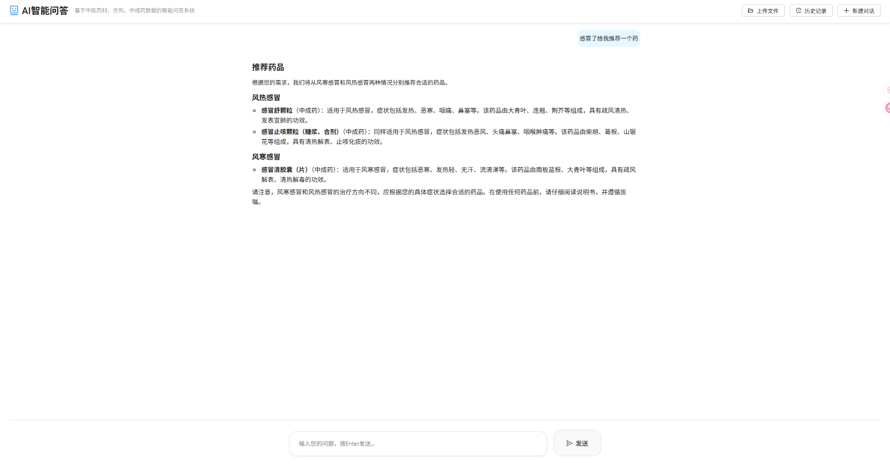
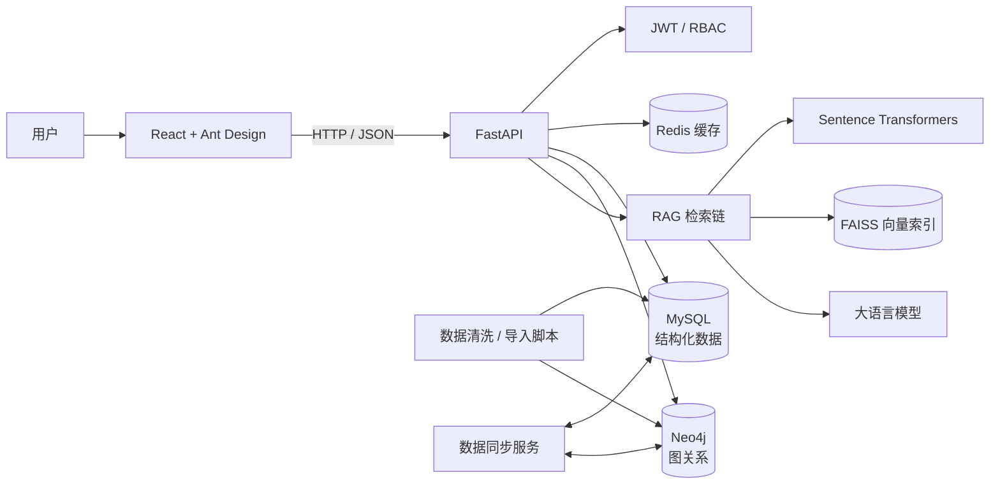

# AIGraphChat · 中医药知识智能查询系统

> 基于 RAG 与知识图谱的中医药知识管理、关系探索与智能问答平台。


## 项目简介

AIGraphChat 是一个面向中医药知识场景的全栈 AI 应用实践。项目将方剂、药材、中成药及其功效关系进行结构化存储，并结合知识图谱、向量检索和大语言模型，支持数据管理、关系可视化、统计分析与基于知识库的智能问答。

这个项目重点验证了一条完整的 AI 应用工程链路：从原始数据清洗、关系建模和向量化，到 API 服务、权限管理、可视化前端与 RAG 问答交互。

## 项目亮点

- **RAG 智能问答**：结合 Sentence Transformers 与 FAISS 检索业务知识，在检索结果基础上组织回答，降低纯生成式回答的不可追溯性。
- **知识图谱探索**：使用 Neo4j 建模方剂、中成药、功效、角色与药材关系，通过 D3.js 实现子图扩展、节点查询和相似节点推荐。
- **双数据库架构**：MySQL 承载结构化业务数据，Neo4j 承载图关系，后台提供同步、状态查看与一致性验证能力。
- **全链路数据管理**：支持方剂、药材和中成药的查询、筛选、编辑、删除及批量导入导出。
- **可视化分析**：展示数据规模、科室分布、功效分布和高频配伍等统计结果。
- **认证与权限**：基于 JWT 与 RBAC 区分普通用户和管理员操作，后端对用户与管理路由进行分层。
- **缓存与模块化设计**：引入 Redis 缓存热点查询，后端按 API、Service、DAL、Model 分层，便于独立扩展业务模块。

## 系统展示

### 数据概览与统计分析



### 方剂与药材数据管理



### 知识图谱与关系探索



### 基于知识库的 AI 问答



## 系统架构



## 技术实现深挖

### RAG 检索链

当前默认问答链路采用“结构化实体向量检索 + 来源标注上下文 + LLM 生成”的实现，主流程如下：

1. **离线建库**：`data2faiss.py` 将每个药材、方剂和中成药整理为一条结构化文本及元数据，即“一个实体一条索引文档”。
2. **向量化**：使用 BGE-M3 与 Sentence Transformers 生成归一化向量。
3. **近似检索**：FAISS 使用 `IndexFlatIP`；向量归一化后，内积等价于余弦相似度。
4. **默认召回**：`chat_with_context` 调用简化检索链，对预处理后的原始问题执行单查询 Top-8 召回。
5. **过滤与去重**：保留 `score > 0.2` 的结果，以文本前 100 字、实体名称和实体类型组成去重键。
6. **上下文组装**：按方剂、药材、中成药的优先级组织结果，保留来源和实体名称后写入提示词。
7. **对话生成**：仅带入最近 6 条对话消息，生成上限为 `max_tokens=1200`。

#### 切块策略

- 业务知识库来自结构化实体，不使用通用长文档切块；每个实体的名称、组成、功效、来源等字段被合并成一条可检索文本。
- 用户上传文档采用段落优先切分，默认块大小上限约为 800 字符。重叠部分由上一块尾部若干词组成；参数 `overlap=100` 是启发式重叠配置，并非严格的 100 字符滑动窗口。

#### Multi-Query 实验路径

代码中还保留了一条更复杂的 Multi-Query 检索实现：LLM 根据原问题生成 3–5 个扩展查询，使用 BGE 向量余弦相似度过滤语义漂移，再对原查询和合格扩展查询分别检索，完成类型平衡召回、合并、得分排序与去重。

> **当前状态**：Multi-Query 函数已实现，但默认聊天入口仍使用简化单查询链。因此本项目不将 Multi-Query 描述为已上线的默认能力。

| 检索能力 | 实现状态 | 工程边界 |
| --- | --- | --- |
| BGE-M3 + FAISS 余弦检索 | 默认链路已使用 | 当前为精确向量索引 `IndexFlatIP`，未进行 ANN 索引参数对比 |
| 得分过滤、去重、类型排序 | 默认链路已使用 | “重排”仅指 FAISS 得分和类型优先级，不是 Cross-Encoder 语义重排 |
| LLM Multi-Query + 语义防漂移 | 已实现实验代码 | 尚未接入默认问答入口 |
| 用户文档段落切块 | 已实现 | 索引保存在进程内存中，服务重启后需重建 |
| HyDE / Self-RAG | 未实现 | 可作为后续检索研究方向 |
| 严格 Token Budget | 未实现 | 当前使用消息条数和输出 Token 上限简化控制 |
| 自动召回/回答评测 | 未实现 | 缺少 Recall@K、MRR、Faithfulness 等离线指标 |

### 知识图谱：从可视化到图分析

图谱层不只返回用于 D3.js 渲染的节点和边，后端还实现了以下结构化分析：

- **方剂和中成药相似度**：根据两个实体的共享药材集合计算 Jaccard 相似度：`|交集| / |并集|`。
- **药材相似度**：根据共享功效节点集合计算 Jaccard 相似度，同时返回共享功效名称作为可解释依据。
- **路径发现**：服务层 `find_path_between` 使用 Cypher `shortestPath` 和有界可变长关系匹配，支持限制最大深度。
- **网络分析辅助**：已实现药材—功效网络、配伍结构分析、关系类型统计、节点集合子图扩展和名称搜索。

| 图谱能力 | 实现状态 | 工程边界 |
| --- | --- | --- |
| 基于共享药材/功效的 Jaccard 相似度 | 已接入后端 API | 属于集合相似度|
| 子图扩展与节点查询 | 已接入后端 API | 子图服务当前完整组装返回的边数组 |
| 模式搜索 | 已实现基础版 | 当前实质是节点名称 `CONTAINS` 检索 |


这些边界是当前版本的真实工程状态：项目已从单纯可视化向可解释相似度和路径分析延伸

## 技术栈

| 分层 | 技术 |
| --- | --- |
| 前端 | React 18、Vite、Ant Design、D3.js、Recharts、React Query、Zustand |
| 后端 | Python、FastAPI、SQLAlchemy、Pydantic、JWT |
| 数据层 | MySQL、Neo4j、Redis |
| AI / 检索 | Sentence Transformers、FAISS、LangChain、OpenAI-compatible API |
| 工程化 | Docker 配置、分层服务架构、批量导入脚本 |

## 快速开始

### 1. 环境要求

- Python 3.10+
- Node.js 18+
- MySQL 8.0
- Neo4j 4.4+
- Redis 6+ 

### 2. 配置后端

```powershell
cd backend
Copy-Item .env.example .env
python -m venv .venv
.\.venv\Scripts\Activate.ps1
pip install -r requirements.txt
```

编辑 `backend/.env`，填写本地 MySQL、Neo4j 和可选的模型 API 配置。请务必替换示例密码，不要将真实 `.env` 提交到 Git。

### 3. 启动后端

```powershell
cd backend
.\.venv\Scripts\Activate.ps1
python -m uvicorn app.main:app --host 0.0.0.0 --port 10001 --reload
```

- API 根路径：`http://localhost:10001`
- Swagger 文档：`http://localhost:10001/docs`

### 4. 启动前端

```powershell
cd frontend
npm install
npm run dev
```

访问 `http://localhost:3000`。Vite 会将 `/api` 请求代理到 `http://localhost:10001`。

> 仓库保留了后端、MySQL 与 Compose 的容器化配置骨架

## 项目结构

```text
AIGraphChat/
├── backend/                 # FastAPI 应用、业务服务、DAL 与导入脚本
│   ├── app/api/             # 认证、数据、图谱、AI 和同步接口
│   ├── app/services/        # RAG、检索、知识图谱与同步服务
│   ├── app/dal/             # MySQL / Neo4j 数据访问层
│   └── scripts/             # 数据库初始化与导入工具
├── frontend/                # React 前端
│   └── src/                 # 页面、组件、服务与状态管理
├── docker/                  # 容器化与数据库初始化配置
├── spider/                  # 数据采集脚本
├── data2faiss.py            # 数据向量化和 FAISS 索引构建
└── docker-compose.yml       # 服务编排配置骨架
```

## 数据与隐私说明

本仓库仅发布代码与必要的示例配置，**不包含**：

- 原始或处理后的中医药数据集
- 真实 `.env` 和 API 密钥
- FAISS 向量索引与元数据
- 模型权重、模型缓存和数据库持久化目录

如需复现完整效果，请使用自行获得授权的数据，按 `backend/scripts/` 中的导入流程建立本地数据库和向量索引。

## 免责声明

本项目用于知识查询、辅助学习与技术演示，**不提供医疗诊断或个人化用药建议**。AI 生成内容可能存在错误或遗漏，不能替代执业医师、执业药师或其他专业人员的判断。
